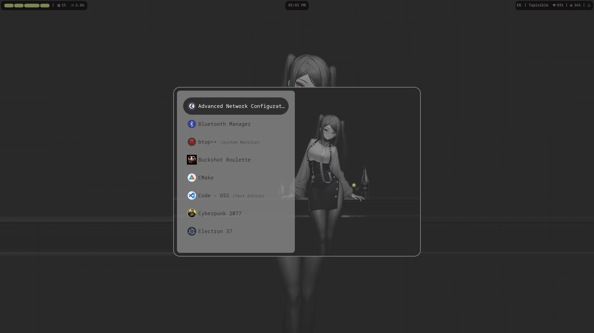
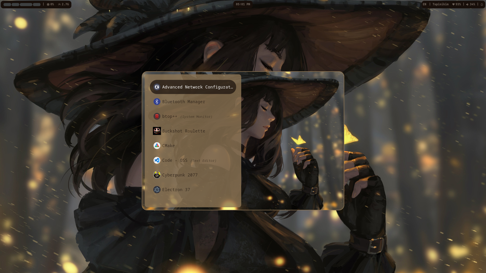
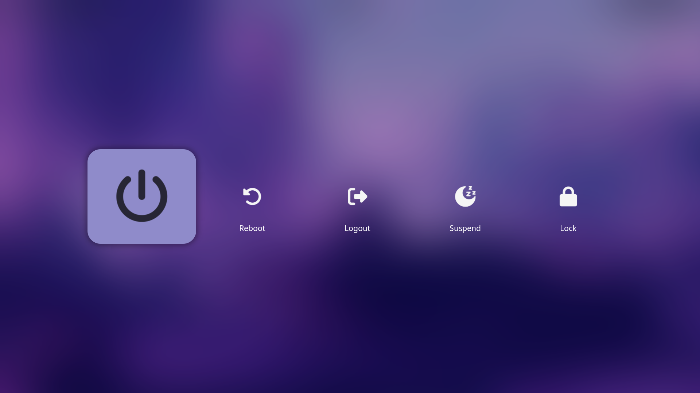
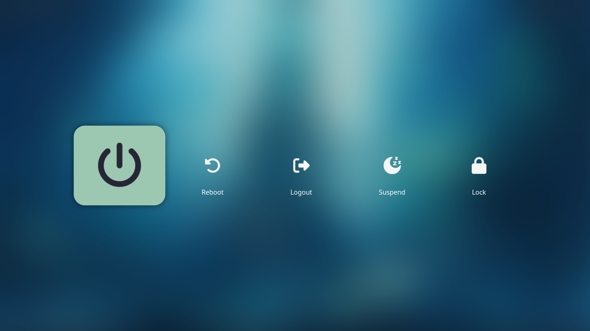
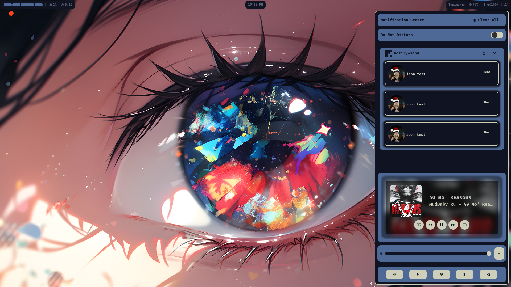
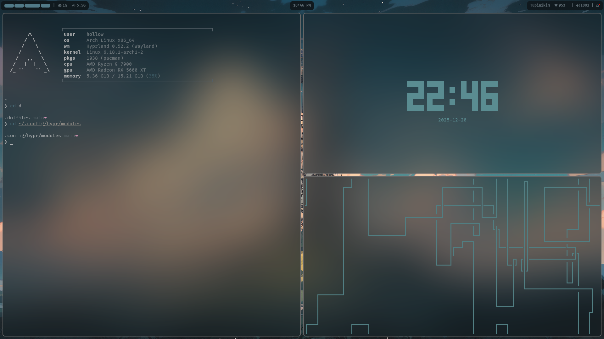

<h2 align="center">
    My hyprland + arch config
</h2>

<h3 align="center">
    I made it almost fully pywal integrated, most of my system is set to change colors using pywal, planning on changing that later.
</h3>

# Main configs 
- Rofi
- Waybar 
- Wlogout
- Swaync
- Swww 
- Hyprlock 
- Ly 
- Ranger (file explorer)
- Kitty + starship + fastfetch 
- Hypridle

# Screenshots

Waybar

Rofi

Wlogout

Swaync

Terminal + CLI 

# To do 

- [ ] Implement a rofi wallpaper switcher 
- [ ] Switch to matugen or another similar tool 
- [ ] Learn how to use and implement quickshell 

# Progress 

- [X] Switch to rofi
- [X] Hyprland
- [X] Hyprlock
- [X] Waybar
- [X] Wlogout
- [X] Swaync 

# Thanks to 

- My friend [Ayru](https://github.com/ayrudev) for introducing me to the linux community and for helping me with the problems I ran into while configuring my system and learning how to manage arch

- [zDyant](https://github.com/zDyant) for the inspirations on my main configs 

